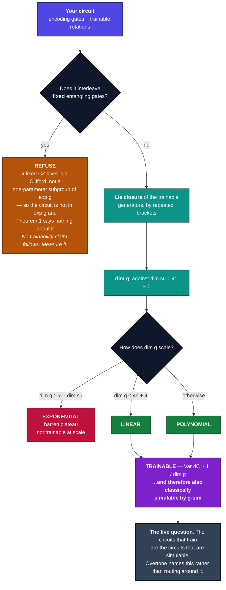
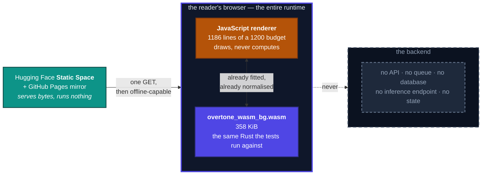
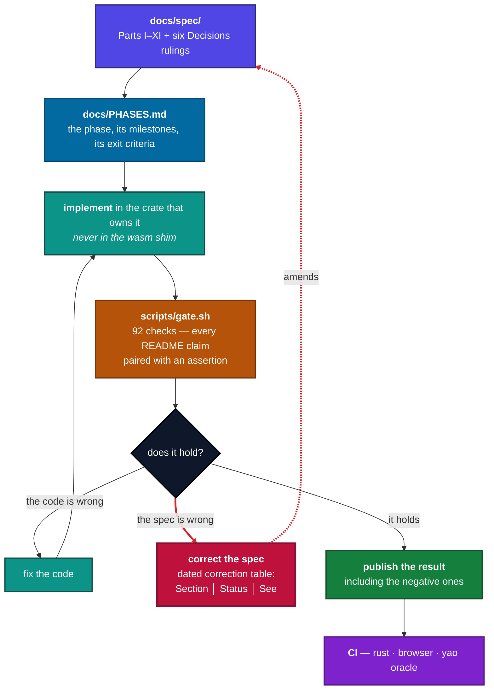
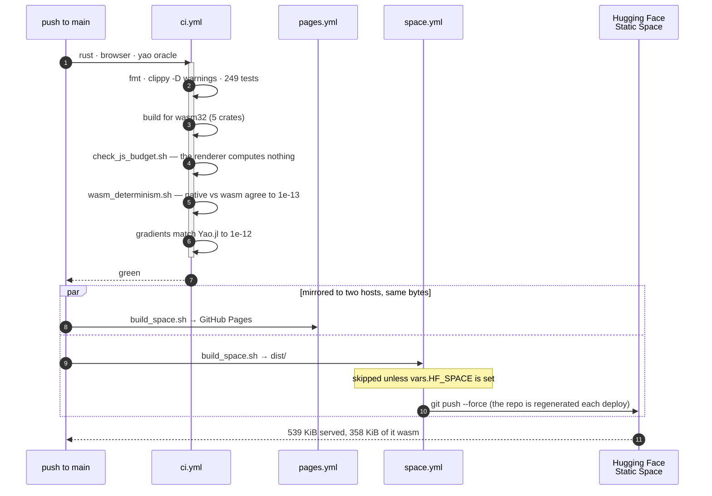

# Overtone

Watch a quantum agent tune itself into resonance with its environment.

A variational quantum circuit that encodes classical data is, exactly and provably, a
truncated Fourier series in that data. The frequencies it can reach are fixed by the
eigenvalues of the data-encoding gates; the coefficients are set by everything else in the
circuit. That is Schuld, Sweke and Meyer, *Phys. Rev. A* **103**, 032430 (2021).

Overtone points that theorem at a reinforcement-learning policy in real time.

> **Overtone reads your circuit's algebra and predicts whether it will train — before you
> train it.**
>
> The prediction holds when the theory's hypotheses hold. Overtone checks them and tells you
> when they do not. It also measures whether your trainable circuit is one a classical
> computer could already simulate — because for most known constructions, it is.

The second paragraph is load-bearing rather than a hedge. `predict` refuses to answer when
`rho` and `O` both sit outside `g`, because `Var[dC] ~ 1/dim(g)` is a theorem with hypotheses
and Diaz et al. exhibit polynomial-`dim(g)` circuits that plateau anyway. A tool that says *"I
cannot predict this one, and here is why"* is worth more than one that always answers, and
there is a gate line asserting that it still refuses.

**A hundred-qubit quantum RL policy trains exactly, in four seconds, on one CPU core.** Not
sampled, not approximated: the transverse-field Ising algebra has dimension `n(2n-1)`, which
is 19900 numbers at `n = 100` instead of `2^100` amplitudes, and the simulation is exact.
**The caveat belongs in the same paragraph:** that works precisely because `dim(g)` is
polynomial, and a polynomial `dim(g)` is exactly the condition for having no barren plateau.
The circuits that train are the circuits that are classically simulable. That tension is the
live question in the field, and this repository names it rather than routing around it.

**Status: Phases 1-9 and 12-15 complete; Phase 5 partial.** The simulator, both gradient paths, the RL loop, the LP
ceiling, the spectral instrument, the browser demo, the closure engine, g-sim, the
dequantization test, the substrate worlds, the transport instrument, the maze eigenbasis, the
linearly-solvable MDP, the optimiser flatline, the quantile critic and shot dial, eigenoptions
with Go-Explore, and architecture search with its verification, and Orbit's win condition, turn loop, endgame tablebase and complexity
dial are built and verified. Since then: thermography and the Chinese Rings (Phase 12), two-particle
exchange statistics, the `.otn` notation and the Overtone-100 benchmark (Phase 13), the coined
walk operator with Kempe's hypercube gap and the welded-tree reduction (Phase 14), and the
frozen agent language v1 (Phase 15). Phase 9 is headless by design: Part VII forbids an interface
before the game's depth has been measured. Phase 5, the lattice, is **partial**: its M8 landed in
Phase 14 and its M28 in Phase 13, and what remains is the two-dimensional maze, the dark
corridor, and M9's learned coin. See [docs/PHASES.md](docs/PHASES.md) for the plan and
[docs/spec/](docs/spec/) for the full build specification, Parts I to VIII plus the VI-A
traps addendum. Part VII supersedes Part VI: the arena is turn-based, the tab is `Orbit`,
and it is not built until its depth has been measured headless.

---

## The instrument, in one diagram

This is `predict`, drawn from the code that implements it
([`crates/overtone-lie/src/predict.rs`](crates/overtone-lie/src/predict.rs)) rather than from
the idea of it. The branch on the left is the one that matters: **the tool has a path that
ends in refusing to answer**, and that path is reached by our own Part I ansatz.



Read the amber box as the product feature it is. `predict` refuses because `Var[dC] ~ 1/dim(g)`
is a theorem with hypotheses, and Diaz et al. ([arXiv:2310.11505](https://arxiv.org/abs/2310.11505))
exhibit polynomial-`dim(g)` circuits that plateau anyway. There is a gate line asserting the
refusal still happens, so it cannot rot into an answer.

---

## The result, in one table

`SpectralControl-k` is a contextual bandit with reward `r(s, a) = (2a - 1) cos(k s)`. Its
expected return is `J = E_s[cos(ks) (2 pi(1|s) - 1)]`, which extracts precisely the
frequency-`k` Fourier coefficient of the policy and ignores everything else. So a policy
that cannot reach frequency `k` cannot score. At all.

Measured, at `k = 3`, 5000 episodes, seeded:

| Policy | Encoding ceiling | LP ceiling | Achieved `J` |
|---|---|---|---|
| RAW-PQC, `lambda` pinned | 2 | 0 | **0.000000** |
| RAW-PQC, `lambda` pinned | 3 | 0.5 | 0.499656 |
| RAW-PQC, `lambda` **trainable** | 1 | 0 | **0.500940** |
| SOFTMAX-PQC, `lambda` pinned | 2 | 0 | **0.110075** |

Row one is the prediction that makes this repo worth reading: not "worse", not "near
chance" — exactly zero, for every parameter setting, forever. Rows three and four are the
two different ways out of that box, and they are not the same escape.

Reproduce all four:

```
cargo run --release -p overtone-cli -- train --k 3 --layers 2 --policy raw
cargo run --release -p overtone-cli -- train --k 3 --layers 1 --scaling trainable --coarse-tune
cargo run --release -p overtone-cli -- ceiling --k 3 --max-c 12
```

Each takes under a quarter of a second.

## The seven standard dismissals, and the instrument for each

Every quantum-ML project meets the same objections. Six of these seven are things Overtone
**measures** rather than things it denies, so the right column is a command you can run rather
than an argument you have to accept.

| Dismissal | The instrument |
|---|---|
| "It's classically simulable / dequantized" | `overtone-cli -- dequantize` — fits the effective bond dimension and prints the verdict |
| "Barren plateaus kill it at scale" | `overtone-cli -- plateau` — gradient variance against qubit count, decay rate fitted live |
| "NISQ noise makes it worse than classical" | `overtone-rl --example shot_dial` — shots needed grow exponentially, and the shallowest optimiser wins |
| "Only works on 4-8 qubits in simulation" | `overtone-gsim --example hundred_qubit_policy` — 100 qubits, exact, one core |
| "Trainable circuits are the ones classical computers handle" | `overtone-cli -- predict` beside `-- dequantize`. **That is the thesis, not an objection to it** |

```
cargo run --release -p overtone-cli  -- dequantize --qubits 4 --layers 3 --k 3 --tolerance 1e-6 --max-chi 8
cargo run --release -p overtone-cli  -- predict --family tfim --qubits 5
cargo run --release -p overtone-cli  -- plateau --depth log:2 --max-qubits 11
cargo run --release -p overtone-rl   --example shot_dial
cargo run --release -p overtone-gsim --example hundred_qubit_policy
```

Two of the seven are not in the table, and their absence is the point of the exercise.

- *"No quantum advantage demonstrated."* None is claimed. There is no panel because there is
  nothing to measure.
- *"An interactive demo doesn't change the asymptotics."* Correct. It does not.

Decisions-03 Q10 sets the bar as **every clause maps to a shipped instrument**, and applied
honestly that bar deletes rows. Those two are arguments, so they are prose and not table rows.

Other standard criticisms are addressed by instruments not yet shipped; **rows appear here when
the panels do**, in the same commit, which is a rule written into
[CONTRIBUTING.md](CONTRIBUTING.md) rather than an intention.

And one external standard, adopted explicitly. Scott Aaronson's **Minus-Sign Test**: to pass,
a popularisation need only *"mention the minus signs: i.e., interference between positive and
negative amplitudes, the defining feature of quantum mechanics, the thing that makes it
different from classical probability theory."* Most quantum popularisation fails it — "in two
states at once" does not distinguish superposition from classical uncertainty. Overtone passes
structurally rather than by effort: phase-as-hue is on every panel, and the dark corridor is
the minus sign made into a mechanic. It is a one-line quality bar from a credible source, and
every explainer page written here is reviewed against it.

---

## The demo

`web/` is the whole project in a browser, with no backend. Every number on the page is
computed there by the same Rust engine the tests run against, compiled to WebAssembly —
no pre-recorded traces, no cached results. The hero is a live `SpectralControl-3` agent with
trainable input scaling, and you watch its single spectral peak slide up the frequency axis
and lock onto the environment at `λ = 3.007`.

Nothing on that page is fetched from a server, because there is no server. The diagram below
is the whole runtime, and the dashed box is the part that does not exist:



That is not an architecture choice made to fit a free tier — the arrow was already one-way
before deployment was considered. `scripts/wasm_determinism.sh` requires native and WASM to
agree to `1e-13`, and `scripts/check_js_budget.sh` forbids a panel from computing a physical
quantity. Between them the frontend **is** the engine, so a backend would have nothing to do,
and adding one would move logic out of Rust — which is the thing the budget exists to prevent.


```
wasm-pack build crates/overtone-wasm --target web --out-dir pkg --release
mkdir -p web/pkg && cp crates/overtone-wasm/pkg/overtone_wasm{.js,_bg.wasm} web/pkg/
cd web && python3 -m http.server 8731
```

The page carries four sections: `Lab` (Part I), `Closure` (Part III), the Menagerie
(Part IV) and `Lattice` (Part V). The last of those draws proto-value function `k` over a
maze the reader watched collapse, toggles the exponent between real and imaginary with the
mean-spread readout beside it, and composes two solved control tasks with a slider that
prints its own error against solving the third from scratch.

The JavaScript is a renderer and nothing else: **1186 lines of 1200**, enforced in CI. Every
quantity a panel needs arrives from Rust already normalised and ordered, so the renderer
draws and never computes. The budget was 800 in Part I, written when the page was one
section; it was raised once, deliberately, when the page reached three, and has not been
raised since. The rule it enforces is unchanged, and now that it binds the fix is to move
code into Rust rather than raise it again. Deployment is a Hugging Face **Static Space**, which is free for
everyone — Gradio and Docker Spaces run on compute and require a paid plan. That was
re-verified against Hugging Face's own documentation on 2026-09-06 and is quoted in
`scripts/deploy_space.sh`; it has changed before, so it is a release-checklist item rather
than a fact to trust.

## The spectral instrument

Sample `pi(1|s)` over the observation axis, transform, and compare against the frequency
ceiling the encoding allows. A RAW-PQC has nothing above it. A SOFTMAX-PQC does.

```
overtone spectrum --layers 3 --policy softmax

 omega            |c|  in band?
     0    0.500181599  in
     3    0.608374038  in          <- the environment frequency
     6    0.000295828  LEAKED
     9    0.149150652  LEAKED      <- 3rd harmonic
    15    0.054160716  LEAKED      <- 5th harmonic
    21    0.020807...  LEAKED      <- 7th harmonic
# leakage ratio 0.395942           (RAW-PQC on the same circuit: 0.000000)
```

**The claim needed sharpening before it could be tested.** Part I §1.4 states the leakage as
"odd harmonics at `3L`, `5L`". Verified numerically, the accurate statement is: odd
harmonics of the policy's **dominant in-band frequency**, which equals `L` only when the
trained policy concentrates there. On `SpectralControl-k` it concentrates at `k`, so at
`L = k = 3` the ladder lands on 9, 15, 21 — and `3L` coincides with `3k`, which is why the
original phrasing looked right. At `L = 2`, where the policy cannot concentrate at 3, the
leakage is broadband instead. Even multiples are suppressed roughly 500-fold, which is the
signature of an odd nonlinearity and what separates "the softmax leaked" from "the numerics
are noisy".

Two further results the instrument had to get right to be trusted:

- **`|J| <= |c_k|`**, with equality only at perfect phase alignment. The return (quadrature,
  `overtone-rl`) and the spectrum (FFT, `overtone-spec`) share no code, so this bound is a
  genuine cross-check; trained policies saturate it to within 0.05 radians.
- **The frequency-`k` bar is simply absent** below the ceiling. The Phase 2 zero-return
  result, seen directly rather than inferred from a number that happens to be zero.

## Barren plateaus

```
overtone plateau --depth log:2 --max-qubits 11

# local   Var ~ 2^(-0.337 n)   R^2 = 0.8807      <- not exponential; that is the finding
# global  Var ~ 2^(-1.028 n)   R^2 = 0.9988
```

Global collapses exponentially; local does not, while the circuit stays shallow. Run it with
`--depth linear:2` and the local rate rises to `0.914` — the escape is conditional on depth,
so the honest claim is "shallow *and* local", not "local".

Two things reported rather than smoothed over. The measured global rate is `1.03`, not the
`1.98` Part I §6.7 quotes: that figure is the full 2-design result and this ansatz does not
reach a 2-design at these depths. And the tempting explanation — that probing `theta_1`
leaves one side of the circuit trivial and halves the exponent — was tested and **rejected**;
a mid-circuit probe gives `1.08`, not `2`.

## Worlds, and the agent that cannot see them

Write a word on the lattice and let each letter choose which coin the amplitude field meets
at that site. The field's spread obeys `sigma(t) ~ t^beta`, and the exponent moves across its
whole range as the word changes.

```
world               beta     R^2  sigma(600)         measured  literature
periodic           1.000   1.000      324.72        ballistic  ballistic
Fibonacci          0.820   1.000      116.13   superdiffusive  diffusive, no localization
Thue-Morse         0.877   1.000      108.57   superdiffusive  mixed: localized and spreading
Rudin-Shapiro     -0.032   0.106       26.44        saturated  strongly localized
static disorder    0.435   0.195        3.25        saturated  Anderson localization
classical          0.500   1.000       24.49        diffusive  diffusive, exactly 1/2
```

Two of those rows have no exponent at all, and that is the point: **a `beta` without its
`R^2` is not a measurement.** Localization does not produce a small power law, it produces a
`sigma` that stops growing, and a straight line fitted through a plateau reports the
plateau's noise as a slope. The instrument refuses to name a regime when the fit is bad.

Part IV's own table labels Fibonacci singular-continuous and Rudin-Shapiro discrete. Those
are swapped: Fibonacci has a **pure point** spectrum, Thue-Morse is the singular continuous
one, and Rudin-Shapiro is **absolutely continuous** — which is exactly why it behaves like
noise. The behaviours are roughly right; the labels are not, and the caption depends on them.

Then the race, which produced the most interesting negative result in the project so far.
Four agents run the same world: the Hadamard coin, the Grover coin, an optimised coin, and a
classical walk.

```
world              Hadamard     Grover  optimised  optimised coin angles
periodic             0.0197     0.0000     0.1176       2.111      2.099
two-periodic         0.0197     0.0000     0.1335       0.957      1.018
Fibonacci            0.0197     0.0000     0.1178       2.113      2.110
Thue-Morse           0.0197     0.0000     0.1176       1.029      1.032
Rudin-Shapiro        0.0197     0.0000     0.1179       1.027      1.033
static disorder      0.0000     0.0000     0.0000       0.196      0.196
```

The Hadamard column is constant because **a constant coin cannot see the world.** The
substrate chooses between two coins, so an agent that plays the same one at both letters
never reads the substrate: its trace on Fibonacci and on the clean lattice is not similar,
it is bit-identical. Part II says the policy is the coin; an agent whose coin ignores the
local feature has no policy.

And the optimised agent's angles are equal on every world but one. **Conditioning the coin
on the local letter pays only on the periodic structure** — everywhere else the best strategy
found is to ignore the substrate. That is a negative result and it is published here because
it is the interesting one. It also took two corrections to reach: optimising for spread
rewards the coin that does not mix at all, and a single-start search reported the opposite
answer on the Fibonacci world.

The Grover column is zero for a reason worth stating rather than hiding. On a two-dimensional
coin space the Grover diffusion operator `2|s><s| - I` is exactly the Pauli `X`, so the field
oscillates between two sites and never spreads. Part II makes it a mandatory baseline;
reporting that it is degenerate in one dimension is the honest form of that baseline.

Beside all of it sits Wave Function Collapse, which borrows every word here as a metaphor —
cells in "superposition", an "observation" that "collapses" the lowest-entropy cell,
constraints propagating outward. **None of it is quantum**, and that is the panel. Its
entropy is a count of the solver's remaining options; the entropy on the Lab panel is a
property of the state. WFC has no phase, so nothing in it can ever interfere.

## What is verified today

| Claim | Measured | Tolerance | Test |
|---|---|---|---|
| Adjoint and parameter-shift gradients agree | `1.4e-15` | `1e-10` | `overtone-sim/tests/gradients.rs` |
| Gradients and expectation values match Yao.jl | `2.2e-15` | `1e-12` | `lab/test/oracle.jl` |
| Strided kernels match a dense Kronecker reference | `< 1e-12` | `1e-12` | `overtone-sim/tests/kernels.rs` |
| Parallel kernels match serial ones | bit-for-bit | exact | `overtone-sim/tests/parallel.rs` |
| Seeded runs reproduce | bit-for-bit | exact | `overtone-sim/tests/determinism.rs` |
| RAW-PQC below the ceiling scores zero | `0.0` exactly | `1e-12` | `overtone-rl/tests/spectral_ceiling.rs` |
| Trained agents land on the LP staircase | within `0.0004` | `0.05` | `overtone-rl/tests/spectral_ceiling.rs` |
| Policy gradients match a finite difference | `< 1e-5` | `1e-5` | `overtone-rl/tests/policy_gradient.rs` |
| REINFORCE is unbiased for the policy gradient | within 8% | 8% | `overtone-rl/tests/policy_gradient.rs` |
| Reduced LP ceiling matches the unreduced one | `< 5e-5` | `5e-5` | `overtone-rl/src/ceiling.rs` |
| RAW-PQC has no spectral energy above its ceiling | `~1e-16` | `1e-9` | `overtone-spec/tests/bandlimit.rs` |
| SOFTMAX-PQC leaks, on odd harmonics | ratio `0.396` vs `0.0` | — | `overtone-spec/tests/bandlimit.rs` |
| Radix-2 FFT matches a naive DFT | `< 1e-12·N` | `1e-12·N` | `overtone-spec/src/fft.rs` |
| Entanglement entropy matches closed forms | `< 1e-12` | `1e-12` | `overtone-spec/src/entropy.rs` |
| Global gradient variance collapses exponentially | `2^(-1.03n)`, R²`=0.999` | — | `overtone-spec/src/plateau.rs` |
| `dim(g)` matches the published classification | exact, 13 families | exact | `overtone-lie/tests/published_dimensions.rs` |
| Bitset closure matches a dense Gram-Schmidt oracle | exact | exact | `overtone-lie/tests/dense_oracle.rs` |
| Commutator signs match dense matrices | `< 1e-12` | `1e-12` | `overtone-lie/tests/dense_oracle.rs` |
| Ragone et al. Theorem 1 reproduces | ratio `0.97`–`1.03` | 10% | `overtone-gsim/examples/theorem_one.rs` |
| g-sim matches the state vector, value and gradient | `< 1e-12` | `1e-12` | `overtone-gsim/tests/against_state_vector.rs` |
| `rank(QFIM) <= dim(g)` | holds, `n = 2..4` | exact | `overtone-cli/tests/algebra_meets_measurement.rs` |
| A fixed-entangler ansatz escapes its own DLA | rank `> 3n` | — | `overtone-cli/tests/algebra_meets_measurement.rs` |
| A hundred-qubit policy trains | `J: 0 -> 0.251` in 3.9 s | — | `.github/workflows/ci.yml` |
| Every agent here is a small tensor network | `chi = 2..4` | — | `overtone-cli` `dequantize` |
| MPS truncation is exact at full bond dimension | `< 1e-10` | `1e-10` | `overtone-mps/tests/truncation.rs` |
| Aperiodic words match the published sequences | exact, 15 letters | exact | `overtone-walk/tests/transport.rs` |
| A clean lattice is ballistic | `beta = 1.000`, R²`=1.000` | `1.00 ± 0.03` | `overtone-walk/tests/transport.rs` |
| The classical baseline is diffusive | `0.500` exactly | `0.50 ± 0.03` | `overtone-walk/tests/transport.rs` |
| Rudin-Shapiro localizes where Fibonacci spreads | median `0.39` vs `0.83` | — | `overtone-walk/tests/transport.rs` |
| Static disorder saturates rather than scaling | `sigma = 3.2` at `t = 600` | — | `overtone-walk/tests/transport.rs` |
| The light cone is strict | zero outside radius `t` | exact | `overtone-walk/tests/transport.rs` |
| Full decoherence is a simple random walk | TV `0.0025` | sampling | `overtone-walk/tests/transport.rs` |
| A constant coin cannot see the world | traces bit-identical | exact | `overtone-walk/tests/transport.rs` |
| Conditioning pays only on periodic structure | `0.134` vs `0.118` | — | `overtone-walk/tests/transport.rs` |
| The sigil depends on the algebra alone | exact | exact | `overtone-lie/tests/published_dimensions.rs` |
| WFC terminates seam-consistent on every seed | 20 seeds | exact | `overtone-wfc/tests/collapse.rs` |
| The archive beats a single-peak search | `0.502` vs `0.403` | — | `overtone-qd/tests/archive.rs` |
| Every archive descriptor is measured, not authored | responds to the genome | exact | `overtone-qd/tests/archive.rs` |
| The archive is reproducible from its seed | bit-for-bit | exact | `overtone-qd/tests/archive.rs` |
| The sonification beat rate is the detuning | `110·\|k−λ\|`, → 0 | `1e-9` | `overtone-wasm/src/lib.rs` |
| Cycle Laplacian spectrum matches the closed form | `< 1e-10` | `1e-10` | `overtone-graph/tests/eigenbasis.rs` |
| Diffusion conserves probability, interference norm | `< 1e-9` | `1e-9` | `overtone-graph/tests/eigenbasis.rs` |
| The eigensolve recovers shortest paths exactly | every vertex | exact | `overtone-graph/tests/eigenbasis.rs` |
| The optimal policy descends the value function | every vertex | exact | `overtone-graph/tests/eigenbasis.rs` |
| Policies superpose linearly | `4e-22` | `1e-12` | `overtone-graph/tests/eigenbasis.rs` |
| The LMDP error falls as `1/rho` in log space | `0.634 → 0.0063` | ratio 8–12 | `overtone-graph/tests/eigenbasis.rs` |
| Native and wasm32 trajectories agree | `5.55e-16` | `1e-13` | `scripts/wasm_determinism.sh` |
| The page boots and reads from the engine | headless Chrome | — | `.github/workflows/ci.yml` |
| All four optimisers reach a known minimum first | Rosenbrock `< 1e-4` | — | `overtone-opt/tests/optimisers.rs` |
| The shot estimator is unbiased with the stated variance | within 10% | 10% | `overtone-opt/tests/flatline.rs` |
| The metered gradient is the adjoint gradient | `< 1e-10` | `1e-10` | `overtone-opt/tests/flatline.rs` |
| Exact arithmetic does *not* flatline in a plateau | descends at every `n` | — | `overtone-opt/tests/flatline.rs` |
| Shots needed grow exponentially in `n` | `2^(0.60 n)` CMA-ES, `R²=0.973` | `R² > 0.8` | `overtone-opt/tests/flatline.rs` |
| A quantile critic reaches its representation floor | `0.0179` vs `0.0174` | 15% | `overtone-rl/tests/distributional.rs` |
| Huber `kappa = 1` fits an expectile, not a quantile | `0.328` vs `0.0179` | 10× | `overtone-rl/tests/distributional.rs` |
| Shots do not narrow the return distribution | flat at `0.68` | `0.02` | `overtone-rl/tests/distributional.rs` |
| The score-function bias falls with the shot budget | `0.052 → 0.00008` | 20× | `overtone-rl/tests/distributional.rs` |
| The two Laplacians coincide only on a regular graph | `2e-16` vs `> 0.1` | — | `overtone-graph/tests/options.rs` |
| Every eigenoption terminates somewhere | Theorem 3.1 | exact | `overtone-graph/tests/options.rs` |
| Go-Explore's archived route is near-optimal | within 4 hops | 4 hops | `overtone-graph/tests/options.rs` |
| Loop erasure yields a simple path on real edges | every vertex once | exact | `overtone-graph/tests/options.rs` |
| The reach term predicts the trained return | `rho = 0.62` | `> 0.4` | `overtone-qd/tests/architecture.rs` |
| The gate-count penalty has the wrong sign | `rho = -0.49` | `< -0.2` | `overtone-qd/tests/architecture.rs` |
| The combined reward loses to its own reach term | `0.60` vs `0.35` | — | `overtone-qd/tests/architecture.rs` |
| The commutant commutes with all of `g` | every pair | exact | `overtone-orbit/tests/orbit.rs` |
| Orbit invariants are conserved along the orbit | `< 1e-9` | `1e-9` | `overtone-orbit/tests/orbit.rs` |
| The checkmate certificate is never wrong | 0 false positives | exact | `overtone-orbit/tests/orbit.rs` |
| It is provably incomplete by counting | deficit 18 at `n=4` | `> 0` | `overtone-orbit/tests/orbit.rs` |
| ...and complete against real positions | `30/30` | exact | `overtone-orbit/tests/orbit.rs` |
| A bishop conserves square colour, a pawn does not | commutes / does not | exact | `overtone-orbit/tests/game.rs` |
| Branching factor lands in the 25-40 band | 30 at `n=4` | `25..=40` | `overtone-orbit/tests/game.rs` |
| The endgame tablebase matches brute force | every cell, 3 mazes | exact | `overtone-orbit/tests/endgame.rs` |
| The endgame solves inside 100 ms | 16x12 maze | `100 ms` | `overtone-orbit/tests/endgame.rs` |
| The dial moves from evaluable to hard | both ends | exact | `overtone-orbit/tests/dial.rs` |
| Corridor means match Berlekamp & Wolfe | `n = 1..20` | exact `f64` | `overtone-cgt/tests/corridor.rs` |
| Corridor temperature is `1 - 2^(1-n)` | `n = 1..20` | exact `f64` | `overtone-cgt/tests/corridor.rs` |
| Hottest-first is not optimal play | 1 point lost | distinct temps | `overtone-cgt/tests/decompose.rs` |
| ...but it is exact on sums of switches | no disagreement | exhaustive | `overtone-cgt/tests/decompose.rs` |
| The rings state graph is a path | `n = 1..12` | 2 endpoints | `overtone-graph/tests/rings.rs` |
| Rings solution length is A000975 | 85 at `n = 7` | exact | `overtone-graph/tests/rings.rs` |
| Branching 2 and still 85 moves | `1.984` | measured | `overtone-graph/tests/rings.rs` |
| Grover matches `sin^2((2k+1)t)` | 3-9 qubits | `1e-9` | `overtone-orbit/tests/advantage.rs` |
| The souffle point is where predicted | argmax | exact | `overtone-orbit/tests/advantage.rs` |
| Over-rotation falls below a die's floor | 4-14 qubits | every one | `overtone-orbit/tests/advantage.rs` |
| Region decomposition does not leak | 8 seeds | `0.0000` | `overtone-orbit/tests/thermal.rs` |
| The two temperatures do not track | partial `rho = -0.021` | `< 0.25` | `overtone-orbit/examples/twotemps.rs` |
| A 32x32 temperature field fits a frame | `5.6%` of 16.7 ms | `< 100%` | `overtone-cgt/examples/heatmap.rs` |
| Pauli exclusion is exact in the mode basis | identically 0 | exact | `overtone-walk/tests/statistics.rs` |
| ...and absent in the position basis | `0.09375` | measured | `overtone-walk/tests/statistics.rs` |
| The anyonic phase interpolates monotonically | 5 values of `phi` | strict | `overtone-walk/tests/statistics.rs` |
| Adjacent walkers cannot interfere at all | similarity `1.000` | exact | `overtone-walk/tests/statistics.rs` |
| `.otn` export format is byte-exact | a fixed point | exact | `overtone-otn/tests/roundtrip.rs` |
| A future format version is refused, not guessed | both tags | exact | `overtone-otn/tests/roundtrip.rs` |
| A whole game fits a few hundred bytes | 60 plies | `< 900 B` | `overtone-otn/tests/roundtrip.rs` |
| Overtone-100 answers are independently re-derived | `100/100` | exact | `overtone-otn/tests/hundred.rs` |
| No benchmark category can be guessed | `15/15` split | skew `< 0.34` | `overtone-otn/tests/hundred.rs` |
| JavaScript stays a renderer | 1186 lines | 1200 | `scripts/check_js_budget.sh` |

206 integration tests, 249 with unit and doc tests. Every number in the measured column is
produced by the suite, and is the worst case across the full sweep rather than a typical
value.

## The dequantization test, run on ourselves

Part III §5 asks for an instrument that tries to disprove the project's own premise: compress
a trained policy into a matrix product state and report the smallest bond dimension that
reproduces it. Part III §13 adds that the answer is published whatever it says.

Here is what it says.

| Agent | Exact `J` | Effective `chi` at `1e-6` | `J` at `chi = 1` |
|---|---|---|---|
| RAW-PQC, `n = 2`, `L = 2` | 0.000000 | **2** | −0.008 |
| RAW-PQC, `n = 3`, `L = 3` | 0.499313 | **2** | 0.504 |
| RAW-PQC, `n = 4`, `L = 3` | 0.499609 | **3** | 0.505 |
| RAW-PQC, `n = 5`, `L = 3` | 0.499346 | **4** | 0.509 |
| RAW-PQC, `n = 4`, `L = 2`, `lambda` trainable | 0.502044 | **3** | 0.502 |
| SOFTMAX-PQC, `n = 4`, `L = 3` | 0.603913 | **4** | 0.606 |

Every agent in this repository is a small tensor network. Worse, read the last column: at
`chi = 1` — a *product state*, no entanglement at all — the achieved return is not lower
than the exact agent's. It is very slightly higher, because the truncation happens to nudge
the policy toward the sign of `cos(k s)`. Whatever these agents are doing, entanglement is
not what does it.

That is not a defect in the instrument. It is the instrument working, and it is the reason
this repository does not claim a quantum advantage anywhere.

```
overtone dequantize --qubits 4 --layers 3 --k 3
```

## What the algebra knows before you train

```
overtone predict --family tfim --qubits 5

dim(g)              45
dim su(2^n)         1023
scaling             Polynomial
observable          ZZIII
Var[loss]           0.088889   (Ragone et al. 2024, Theorem 1)
rank(QFIM) <=       45
verdict: dim(g) = 45 of 1023 — polynomial: trainable, and therefore also classically
         simulable by g-sim
```

`Var[loss] = 4/45` is a closed form, computed from the generators by XOR and popcount, with
no circuit run. Measured over 4000 random circuits at depth 64: `0.088367`. The ratio of
measurement to prediction across `n = 3..7` is 0.97, 1.03, 0.99, 0.97, 0.99.

Point the same tool at our own Part I ansatz and it refuses to answer:

```
overtone predict --qubits 4 --layers 2

caveat: 8 fixed entangling gates are not one-parameter subgroups of exp(g), so this
        circuit is not in exp(g) and Theorem 1 does not apply to it.
verdict: dim(g) = 12 of 255 for the trainable generators, but this circuit's fixed
         entanglers put it outside exp(g). No trainability claim follows. Measure it.
```

## Twenty things the specification did not say, that turned out to matter

**The frequency ceiling counts encoding gates, not layers.** Part I states the reachable
spectrum as `{-L..L}` for `L` layers. That holds only when each layer applies one encoding
rotation per observation component. Encode the same scalar on all `n` qubits every layer and
the ceiling is `n*L`. This is not pedantry: the headline test is RAW-PQC at `L = 2` scoring
zero against `k = 3`, and on a two-qubit register encoding everywhere the ceiling would be
`4 > 3`, the agent would score, and the repo's central claim would appear to fail. The
ceiling is computed from the encoding map, and there is a test pinning both cases.

**The `lambda` landscape is a resonance curve with a capture range, not a hill.** Part I
says trainable input scaling makes the reachable frequencies continuous, so the peak slides
until it locks onto the environment. True — but only from within the capture range.
Measured at `L = 1` against `k = 3`:

```
main peak       lambda = 3.05   J = 0.502
sidelobes       lambda = 0.66   J = 0.021 · 5.47 -> 0.083 · 7.48 -> 0.051
capture range   lambda_0 in roughly [1.8, 4.2] reaches the main peak
```

Gradient ascent started at `lambda = 1` — the obvious default, since it matches the pinned
circuit — falls outside that range and converges to a sidelobe at `J = 0.021`. So the
demonstration needs a coarse tune before the fine tune, exactly as a radio does. That is a
property of resonance rather than a defect, and `--coarse-tune` is the coarse tune.
`examples/lambda_scan.rs` reproduces the numbers.

**The softmax leakage shows up as return, not only as spectrum.** Part I predicts that a
SOFTMAX-PQC leaks past its own circuit's frequency ceiling, because a sigmoid of a
band-limited function is not band-limited. On this environment that leakage is worth reward:
at `L = 2` against `k = 3`, where a RAW-PQC scores exactly zero, the softmax policy scores
`0.110` by generating a frequency-3 harmonic out of its frequency-1 and 2 content. It stays
below the unconstrained optimum `2/pi`, so the leakage is bounded, not magical.

The consequence is that **the LP staircase bounds RAW-PQC only.** It is not a bound on
softmax policies, and drawing it behind a softmax learning curve would misrepresent both.

A fourth, recorded for Phase 3: the leakage lives in `pi(a|s)`, not in the logit. Part I 6.5
says to transform "the policy's logit function", but for a SOFTMAX-PQC the logit is
`beta * w * <Z>`, which is exactly as band-limited as the RAW-PQC's. The spectral instrument
has to transform the probability, or it will show no leakage and quietly falsify a true
claim.

**Bit-for-bit determinism across native and WASM is not attainable, and the test now says
so.** Part I asks for identical seeded trajectories on both. IEEE-754 requires correct
rounding for arithmetic and `sqrt` but *not* for transcendental functions, and native glibc
`libm` disagrees with wasm32's by one unit in the last place on roughly 5% of `sin`/`cos`
evaluations. A circuit applies thousands of those, so a trajectory drifts in its last two
digits: measured worst relative difference `5.55e-16`. Within a target it *is* bit-exact,
and that is the guarantee permalinks actually need — two people opening the same link run
the same `.wasm` binary. The test asserts a tight tolerance and prints the worst difference
rather than asserting an equality that is false.

**`wasm-bindgen` maps Rust `u64` to JavaScript `BigInt`, not `Number`.** Seeds cross the
boundary as `u32`. The Rust compiled, the wasm built, and the page failed at runtime with
`Cannot convert 7 to a BigInt`; only running it in a real browser found it.

**The spectrum's ceiling rule has to track `λ`.** With trainable scaling the reachable set
is `λ·{-C..C}`, so the ceiling *moves* rather than being exceeded. Drawing it at the integer
ceiling reported the hero — an agent that had just tuned itself into resonance — as having
leaked, with a ratio of 28. The leakage readout is now suppressed as not meaningful whenever
`λ` is trainable, because a non-integer reachable frequency spreads across neighbouring bins
for ordinary sampling reasons that have nothing to do with the softmax.

**Figure 2 of Ragone et al. is a schematic, so M11's acceptance test had nothing to
reproduce.** Part III §9 asks the closure engine to "reproduce Figure 2 of Ragone et al.
(2024)" and put the badge in the README. Figures 1 and 2 of that paper both illustrate
*where* barren plateaus come from — expressiveness, entanglement, locality, noise — and
neither is a numerical plot. What is reproducible, and is a better target, is Theorem 1
itself:

```
Var[loss] = sum_j  P_{g_j}(rho) P_{g_j}(O) / dim(g_j)
```

an exact closed form with nothing to eyeball. The more interesting half is that the
theorem's own hypothesis is visible in the data. It assumes the circuit is deep enough to be
a 2-design over `exp(g)`; at `n = 7` the measured-to-predicted ratio is 1.86 at depth 1,
1.64 at depth 8, 1.08 at depth 32 and 0.99 at depth 64. The prediction is not wrong when the
circuit is shallow. Its premise is not yet true.

**Our own ansatz is not described by its own dynamical Lie algebra.** "The hardware-efficient
ansatz has DLA `su(2^n)`" is true when the entanglers are trainable and false when they are
fixed. Part I §6.2 builds *fixed* CZ layers, so the algebra generated by the trainable gates
is `su(2)^(+n)` — dimension `3n`, polynomial, which would say "trainable" — while Part I
§6.7 measures that same circuit's global-observable gradient variance collapsing like
`2^(-1.03 n)`. There is no contradiction: a fixed Clifford is not a one-parameter subgroup,
the circuit is not in `exp(g)`, and Theorem 1 has no hypothesis to stand on. This is
asserted by measurement rather than by argument — the circuit's Fisher rank exceeds `3n`,
which an algebra containing it could not permit — and `overtone predict` refuses to make a
trainability claim when fixed entanglers are present. Part III §14 lists Diaz et al.,
arXiv:2310.11505 for precisely this gap; it is worth reading before quoting `dim(g)` at
anyone.

**A hundred-qubit agent scored exactly zero, and it was a theorem rather than a bug.** With
generators `{X_q} ∪ {Z_qZ_{q+1}}`, observable `sum_q X_q` and one layer, the policy is an odd
function of the observation for *every* parameter setting, so its correlation against
`cos(k s)` vanishes identically and the gradient is zero in every direction. The proof is a
conserved quantity: multiplying a Pauli string by `Z_aZ_b` toggles `X <-> Y` and `I <-> Z` at
both sites, and a string only fails to commute with `Z_aZ_b` when exactly one of the two
sites carries an `X` or a `Y` — so the number of `X`-or-`Y` letters never changes. Starting
from `X_q` it is one forever, only `I`/`Z` strings survive in `|0...0>`, and reaching one
costs exactly one factor of `sin(lambda s)`.

The first version of that paragraph claimed it held at every depth. It does not: a second
layer gives the variational `RX` gates a string with a `Z` to act on, the count can then
visit two, and the parity is no longer pinned. The claim survived a test that had only ever
reached one layer. Both directions are asserted now.


**Part IV's spectral labels for the aperiodic words are swapped.** Its table calls Fibonacci
singular-continuous and Rudin-Shapiro discrete, and then rests the panel's caption on "the
difference is the nature of the spectrum". Fibonacci has a **pure point** spectrum,
Thue-Morse is the singular continuous one, and Rudin-Shapiro is **absolutely continuous** —
which is exactly why it behaves like noise and localizes. The transport behaviours in that
table are roughly right; the attributions are not, and they are the part the exposition
leans on.

**A transport exponent without its `R^2` is not a measurement.** Anderson localization does
not produce a small power law. It produces a `sigma` that stops growing, and a straight line
fitted through a plateau reports whatever the noise on the plateau happens to slope. The
first disorder run reported `beta = 0.44`, which reads as *diffusive* — a completely wrong
description of a field confined to three sites. Worse, a single seeded realisation of a
two-letter disorder word gave exponents from `0.15` to `0.34` depending on the seed, because
weak binary disorder has a long localisation length. The instrument now rejects the fit on
its `R^2` before reading `beta`, and the disorder world draws a continuous coin angle per
site, which is what Anderson localization is a statement about.

**Optimising a walker for spread teaches it nothing.** `sigma` is maximised by the coin that
does not superpose at all: the field splits into two ballistic beams that sit exactly on the
light cone and `sigma` comes out at very nearly `t`. That coin is optimal on every substrate,
so the "optimised" agent was identical on all six worlds and the race was a table of the same
number six times. The objective has to be one the world can help or hinder, which is Part
II's own choice — arrival, the thing a hitting time measures.

That fix exposed a second one. With a single-start search the optimiser reported that
conditioning the coin on the local letter helps on the Fibonacci world. It does not; the
search had settled in a local optimum scoring `0.074` while a coin that ignores the substrate
scores `0.118`. Arrival probability at one site oscillates sharply in the coin angle, so a
16-point grid ranks the blind solutions badly. With the diagonal searched properly the answer
reverses, and the honest result is a negative one: **conditioning pays only on the periodic
word.**


**A barren-plateau demonstration written with exact expectation values shows the opposite of
the paper it cites.** Part V asks for four optimisers racing deep in a plateau, all flat,
citing Arrasmith et al. But their result is that the cost function *differences* are
exponentially suppressed — the obstruction is measurement precision, not the shape of the
landscape. Give an optimiser `f64` values from a state vector and it has sixteen digits,
which dwarfs the `2^(-1.03 n)` differences at any width a browser can simulate. Measured:
with exact arithmetic all four descend at every `n` from 2 to 10, on every seed, Nelder–Mead
included. The demo needs a shot budget or it is a demo of the opposite claim.

**And "all four flatline" is still too strong.** Shots per evaluation needed before an
optimiser beats its own noise:

```
   n   params    gradient   natural gradient    CMA-ES   Nelder-Mead
   2        8          16                 32        16           256
   4       32          32                 32        32          4096
   6       72         256                256        64          8192
   8      128        4096               4096       128         65536
  10      200       32768              16384       512       > 65536

  fitted as shots ~ 2^(a n)
   gradient  a = 1.450  R^2 = 0.969        CMA-ES  a = 0.600  R^2 = 0.973
   natural   a = 1.250  R^2 = 0.936   Nelder-Mead  a = 1.250  R^2 = 0.954
```

Every exponent is positive, which is the paper's result. They are not the same exponent, and
a population method — whose decision is a rank over `lambda` samples rather than a difference
between two — survives about four times further in `n`. The slogan hides that.

**Never score a noisy optimiser on the best value it saw.** It is a minimum over many draws,
so it rewards whichever optimiser evaluated most, and rewards the noise. At `n = 4` with 100
shots the natural-gradient lane believed it had reached `-0.52`; the exact cost where it
actually stopped was `+0.25`, above where it started. Every lane here is scored on the exact
cost at its final iterate, computed off the meter.

**Shots do not sharpen a return distribution.** Part V asks to "sweep shots from 10 to 10,000
and watch the return distribution sharpen". Two distributions are in play and only one depends
on the shot count. The return distribution is aleatoric — on `SpectralControl` it is two atoms
at `±cos(ks)` — and its spread is flat at `0.68` across three decades of shots. What sharpens
is the *estimate*. What a shot budget really buys is the **score function**, which is
nonlinear in the measured `z`, so a cheap measurement biases the gradient: `0.052` at 10
shots, `0.0029` at 100, `0.0004` at 1000, `0.00008` at 10,000.

**The published Huber `kappa = 1` fits an expectile, not a quantile, on returns of order
one.** Dabney et al. chose it against Atari returns in the hundreds. Here every residual falls
inside the Huber quadratic, so the subgradient is `u` rather than `sign(u)` and the fixed
point moves. At `kappa = 1` the 1-Wasserstein distance to a known two-atom distribution stalls
at `0.328` however many samples arrive; at `kappa = 0` it reaches `0.0179` against a
representation floor of `0.0174`. Reading their eq. 9 literally at `kappa = 0` also gives no
gradient at all, so that case is the plain quantile loss by their own `rho^0_tau = rho_tau`.

**Machado et al. use two different Laplacians in two different sections.** §2.3 says "the
normalized graph Laplacian, which we use in this paper"; §5's sample-based algorithm recovers
the combinatorial one, since its incidence matrix satisfies `T^T T = 2(D − W)`. On a regular
graph that is one diffusion model — `‖L/d − L_norm‖∞ = 2e-16` on a cycle — and on a maze it is
two, at `0.80`, disagreeing on the chosen action at `0.594` of states. Neither is wrong;
naming which one a call site means is the fix.

**Do not compare eigenvector-derived quantities on a degenerate spectrum.** The first control
for that claim was a 24-cycle, whose Laplacian eigenvalues come in pairs. Inside a degenerate
eigenspace any rotation is a valid basis, so two solvers disagreed there by `0.79` for reasons
that had nothing to do with the graph. The maze's low spectrum is simple to `3.8e-3`, which is
what makes its disagreement real, and the matrix-level statement needs no such caveat at all.

**Go-Explore does not beat an undirected walk at every size, and the crossover is the
budget.** Loop-erasing both trajectories, so the comparison is between two post-processed
answers rather than one: at 101 vertices they tie; at 962 the archive finds a distant goal
21/21 against 12/21; at 2751 it finds it **2/21 against 8/21**. Give the same 2751-vertex maze
four times the budget and it is 21/21 against 20/21. Return-then-explore spends its opening
steps building an archive and only then aims. Part V's claim that it is "the right exploration
algorithm for an endless maze" holds in a window, and the window is set by step count.

**Part V's algebraic architecture reward is beaten by its own reach term.** The verification
the spec itself demands, over 200 architectures each trained to convergence on the exact
policy gradient:

```
  predictor                 Spearman rho
  reach itself                    0.618
  reach covers k                  0.581
  -gate count                    -0.486     <- the wrong sign
  dim(g) is polynomial           -0.060
  untrained return                0.076
```

Gates track layers, layers track the frequency ceiling, so charging for gates charges for
reach. Selecting the top twenty by the three-term reward is indistinguishable from random
selection — five seeds above, five below — while selecting on reach alone beats random on all
ten and beats the combined reward on nine. Adding two terms that carry no signal to one that
does costs the whole of the signal.

**And the `dim(g)` term cannot be validated on a problem small enough to validate it on.** It
is a *trainability* proxy, and two to five qubits with an exact analytic gradient has no
barren plateau to be saved from. That is the same reason the archive's fitness-by-`dim(g)`
profile came out flat and the same reason the optimiser flatline needed shot noise to appear.
The conclusion is not that `dim(g)` fails to predict trainability — it is that this
environment cannot test the claim, and a term nobody can validate should not carry a weight.


## Temperature, and the two sentences that did not survive being tested

Part VII forbids invented numbers, which leaves a hole: a game needs move ordering, and the
usual answer is a hand-tuned evaluation function — the invented number the rules prohibit.
Combinatorial game theory fills it with a derived quantity. A position decomposes into
independent regions, each region has a **temperature** computed by thermography, and the
temperature is a property of the position rather than a weight somebody chose.

The implementation is pinned to a published Go endgame, because Part IX §8 says that if it
cannot reproduce one, the heat map is decoration. Berlekamp & Wolfe analyse the closed empty
corridor as a recursion with no board in it — `Corr(0) = 0`, `Corr(n+1) = {n | Corr(n)}` —
and publish `f(Corr(n)) = n - 2 + (1/2)^(n-1)` for the chilled value. Thermography computes
the mean independently, from the walls, and the two agree for `n = 1..20` under `assert_eq!`
on `f64` with **no tolerance at all**: every quantity in temperature theory is a dyadic
rational, and dyadic rationals below `2^52` are exact in binary floating point.

Two sentences in the spec did not survive.

**"Optimal play is to move in the hottest region" is false.** An exhaustive search over
disjunctive sums finds a counterexample with two components and distinct temperatures, so it
is not a gap about ties:

```
{0 | -3}  +  {{1 | -2} | -3}          Left to move
temperature 1.5      temperature 1.0
optimal stop -2,  hottest-first -3,  loss 1 point
```

The colder component's *left option* is a switch of temperature 1.5 — hotter than the
component containing it. Greedy ordering assumes the heat it can see is all the heat there
is. The rule is not worthless: on sums of plain switches the same search finds no
disagreement anywhere, which is exactly the case the theory covers. So temperature gives
Overtone a derived move *ordering*, and not a proof of optimality.

Getting there required two filters, both added because the search first returned nonsense.
It offered `{{-1|-2} | 1}`, which **is a number** by the simplicity rule — every left option
is strictly below every right option — even though no option list is all-numeric. A game that
is hot all the way down cannot be a number, and that predicate is what made the result real.

**And CGT temperature does not apply to Overtone as stated.** Berlekamp's own survey opens:
*"In its broadest sense, Combinatorial Game Theory (CGT) is the study of two-person, perfect
information games of no chance."* Overtone has chance — a player may measure, and the Born
rule is a chance node. Temperature is therefore defined on the **coherent segment**, the run
of unitary turns between one measurement and the next, and is undefined across a collapse.
That is the honest domain of the tool rather than a workaround, and it happens to be the
interval a player is reasoning about when deciding where to move.

### Two temperatures, and a confound that ate the result

Combinatorial game theory borrowed "temperature" from thermodynamics as a metaphor. Overtone
has actual thermodynamics. Do the two track each other? Nobody has asked, because no game has
ever had both.

Eight seeds said yes: mean rank correlation `0.49`, the same sign every time. That was wrong.
Both series climb over the course of a game — temperature against ply at `rho = 0.76`,
entropy against ply at `0.46` — so a correlation between them is mostly a correlation with
time. Doubling the seeds and partialling out the ply:

```
raw rho        mean  0.344    range [-0.089, 0.813]    sign not consistent
partial rho    mean -0.021    range [-0.558,  0.500]   sign mixed, 8 of 15
```

They share a name. They do not share a behaviour. A measurement in the other direction went
the spec's way: the **interaction leak**, the gap between the best move over the whole
position and the best found one region at a time, is `0.0000` on every seed. The
decomposition Part IX §5.3 assumes is not merely adequate here, it is exact.

### The oldest counterexample in the project

The Chinese Rings has a state graph that is a **path** — not a tree, a line — on `2^n`
vertices, ordered by the Gray code `G(i) = i XOR (i>>1)`, with the solved state at distance
`A000975(n)`. Built here from the puzzle's two move rules, with everything else measured off
it rather than asserted:

```
substrate               states   branching   diameter
4x4 maze                    16       3.000          6
7 rings                    128       1.984        127
Pauli hypercube q=3         64       6.000          6
```

Seven rings offer 1.98 moves per state and still take 85 of them. A 4x4 maze offers three and
is six deep. **Difficulty does not come from the number of options — it comes from the
difficulty of knowing which option is forward.**

The puzzle is not, however, two thousand years old. The attribution to Zhuge Liang traces to
Stewart Culin relying on an unnamed informant; the earliest definitive references are Yang
Shen's *Sheng an ji* (early 16th century) and Pacioli's *De Viribus Quantitatis* (1509), with
Cardano's *De subtilitate* (1550) giving it the name "Cardan's rings". It postdates
al-Khwarizmi by seven centuries, so it is not older than algebra either. The argument survives
the correction intact.


## Why three gradient checks and not one

The adjoint path is what training uses: constant memory in circuit depth, every parameter in
roughly two forward passes. It is also where a sign error hides comfortably, because it is
only ever compared against itself.

So it is checked three ways. The **parameter-shift rule** is exact rather than a finite
difference and is what hardware would evaluate, sharing no implementation with the adjoint
sweep. A **central finite difference** is a third opinion: if the two analytic paths agree
with each other but disagree with it, the fault is in an assumption they share, such as the
generator convention. And **Yao.jl** checks the whole engine from outside — different
language, different author, different algorithm.

The same discipline runs one level up. `REINFORCE` is checked against the analytic policy
gradient it is supposed to estimate, and the reduced LP ceiling against the unreduced
formulation it was derived from.

## The LP ceiling

Given a frequency ceiling `C`, the best expected return any *strictly band-limited* policy
can reach on `SpectralControl-k` is the answer to: maximise the frequency-`k` Fourier
coefficient of a degree-`C` trig polynomial whose sup norm is at most 1. That is a linear
program.

Averaging over the `k` shifts `s -> s + 2 pi j / k` preserves the sup-norm bound and the
frequency-`k` component while annihilating every frequency that is not a multiple of `k`;
taking the even part then kills the sines. So the problem reduces from `2C+1` variables to
`floor(C/k)+1`, and `J*` depends on `C` only through `floor(C/k)` — which is *why* the
ceiling is a staircase, with steps at multiples of `k`.

There is no usable closed form. The one-sided Carathéodory–Fejér bound `2 cos(pi/(C+2))`
does not apply, since `|p| <= 1` is two-sided and strictly stronger; it returns 0.707 where
the true ceiling is 0.5, and passes straight through the `2/pi` supremum. Part I's
instruction to solve it numerically is well taken.

```
   C           J*        (k = 3)
   0-2   0.000000
   3-8   0.500000
   9-11  0.577350
   inf   0.636620   (2/pi, unconstrained optimum)
```

## Conventions

- `RX(t) = exp(-i t X / 2)`, and likewise RY and RZ.
- Qubit `q` is bit `q` of the basis-state index, little-endian.
- Amplitudes are stored structure-of-arrays, two `f64` planes. SoA autovectorises;
  array-of-structs does not.
- Every random draw is seeded. `overtone-sim` has no entropy dependency at all — dropping
  `rand`'s default features removes `getrandom` from the tree, which enforces the
  determinism requirement at the dependency level and lets the crate build for
  `wasm32-unknown-unknown` with no shim.
- The LP solver is `good_lp` on the pure-Rust `microlp` backend, so `overtone-rl` also
  builds for `wasm32`. The ceiling is drawn behind the learning curve in the browser, so it
  cannot be a native-only convenience.

## The workflow

Overtone is built from a written specification — twelve Parts and six Decisions rulings in
[`docs/spec/`](docs/spec/) — and the loop below is the whole process. The edge that makes it
unusual is the red one: **when a measurement contradicts the specification, the specification
is corrected**, in a dated table at the top of the Part, rather than the measurement being
quietly dropped.



Three claims that were in the README and are not any more went out through the red edge. The
rule they cost is written at the top of `CLAUDE.md`: *a quantity measured only where a game
begins will look like whatever beginnings look like.*

### What happens on a push



Neither host is a single point of failure, and the bundle refuses to build unless every
`href`, `src` and relative JS import resolves inside it — verified by breaking it on purpose,
removing `js/sound.js` and the wasm, and confirming both are caught.


## Building

```
cargo test --workspace                          # 249 tests
cargo test -p overtone-sim --features parallel  # plus the threaded kernels
cargo clippy --workspace --all-targets -- -D warnings
cargo build -p overtone-sim --target wasm32-unknown-unknown
cargo build -p overtone-rl  --target wasm32-unknown-unknown
```

The Yao.jl oracle needs Julia:

```
cargo run -q -p overtone-sim --example emit_oracle_cases > lab/test/cases.txt
julia --project=lab -e 'using Pkg; Pkg.instantiate()'
julia --project=lab lab/test/oracle.jl
```

## Layout

```
crates/overtone-sim/    state vector, gates, adjoint and parameter-shift gradients
crates/overtone-rl/     ansatz, policies, SpectralControl-k, REINFORCE, LP ceiling
crates/overtone-spec/   FFT, spectrum, entropy, gradient variance, QFIM
crates/overtone-lie/    Pauli bitsets, Lie closure, the prediction (Phase 6)
crates/overtone-gsim/   Lie-algebraic simulation and gradients      (Phase 6)
crates/overtone-mps/    bond spectra and the dequantization test    (Phase 6)
crates/overtone-walk/   quantum walks, substrates, transport exponent (Phase 7)
crates/overtone-wfc/    Wave Function Collapse, which is not physics (Phase 7)
crates/overtone-qd/     MAP-Elites: the Menagerie archive             (Phase 7)
crates/overtone-graph/  maze Laplacian, eigenbasis, LMDP, eigenoptions (Phase 8)
crates/overtone-opt/    shot budgets, four optimisers, the flatline   (Phase 8)
crates/overtone-orbit/  Orbit: checkmate, the ladder, the endgame      (Phase 9)
crates/overtone-cgt/    thermography, temperature, decomposition     (Phase 12)
crates/overtone-otn/    the .otn notation and the Overtone-100 benchmark (Phase 13)
crates/overtone-cli/    native trainer, predict, dequantize
crates/overtone-wasm/   wasm-bindgen surface                       (Phase 4)
lab/                    Yao.jl oracle and heavy sweeps
docs/spec/              the build specification, Parts I to IX and VI-A
```

Sixteen crates, **47 internal dependency edges, and not one of them points upward.** The tiers
below are computed from the `Cargo.toml` files rather than asserted — every arrow crosses from
a lower tier to a higher one, which is what makes the rule checkable instead of aspirational:

```mermaid
flowchart TD
    T0["<b>tier 0</b> · depends on nothing of ours<br/><b>overtone-sim</b> state vector, gates, adjoint + parameter-shift gradients<br/><b>overtone-wfc</b> Wave Function Collapse, which is not physics · <b>overtone-cgt</b> thermography"]:::t0
    T1["<b>tier 1</b><br/><b>overtone-rl</b> ansatz, policies, REINFORCE, the LP ceiling<br/><b>overtone-lie</b> Pauli bitsets, Lie closure, the prediction · <b>overtone-walk</b> quantum walks, transport"]:::t1
    T2["<b>tier 2</b><br/><b>overtone-spec</b> FFT, spectrum, entropy, QFIM · <b>overtone-mps</b> bond spectra, the dequantization test<br/><b>overtone-gsim</b> Lie-algebraic simulation and gradients"]:::t2
    T3["<b>tier 3</b><br/><b>overtone-graph</b> maze Laplacian, LMDP, eigenoptions · <b>overtone-opt</b> shot budgets, the flatline<br/><b>overtone-qd</b> MAP-Elites archive · <b>overtone-cli</b> train, predict, dequantize"]:::t3
    T4["<b>tier 4</b><br/><b>overtone-orbit</b> the game: checkmate, the ladder, the endgame, the memo, the Skill Trace<br/><b>overtone-wasm</b> a shim — if it ever contains an <i>if</i> about physics, that logic is in the wrong crate"]:::t4
    T5["<b>tier 5</b><br/><b>overtone-otn</b> the .otn notation and the Overtone-100 benchmark"]:::t5

    T0 ==> T1 ==> T2 ==> T3 ==> T4 ==> T5

    classDef t0 fill:#0f172a,stroke:#38bdf8,stroke-width:3px,color:#e0f2fe
    classDef t1 fill:#4f46e5,stroke:#312e81,stroke-width:3px,color:#ffffff
    classDef t2 fill:#0d9488,stroke:#134e4a,stroke-width:3px,color:#ffffff
    classDef t3 fill:#15803d,stroke:#14532d,stroke-width:3px,color:#ffffff
    classDef t4 fill:#b45309,stroke:#78350f,stroke-width:3px,color:#ffffff
    classDef t5 fill:#7e22ce,stroke:#581c87,stroke-width:3px,color:#ffffff
```




The dependency direction is one-way and load-bearing. `overtone-sim` knows nothing about
reinforcement learning; `overtone-rl` knows nothing about rendering; `overtone-wasm` is a
shim, and if it ever contains an `if` statement about physics, that logic is in the wrong
crate.

## Licence

**AGPL-3.0-or-later.** Copyright (C) 2026 Anbuchelvan Ganesan. Full text in [`LICENSE`](LICENSE);
the reasoning is in [`NOTICE`](NOTICE).

The clause that does the work is section 13. Running a modified Overtone as a network
service counts as conveying it, so a hosted fork owes its source to the people using it —
not only to whoever downloads a tarball. That is deliberate: this is an instrument, its
value is that its measurements can be checked, and a closed hosted variant whose numbers
nobody could audit would defeat the point.

Using Overtone unmodified, or running it privately, obliges you to nothing. Publishing a
modified version — by distribution or over a network — obliges you to publish that
version's source under the same licence.

Earlier commits were published under Apache-2.0 and that grant stands for those versions.
